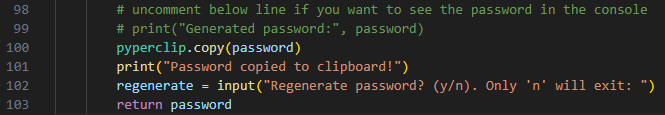

# Password Generator
This script generates passwords that conforms to modern password standards and pastes it in the clipboard. You can also uncomment the line below to see the generated password in the terminal.

To run, execute below commands from your terminal and follow the onscreen instructions. Make sure you cd to the src directory first.
- Linux: `python3 password_generator.py`
- Windows `python password_generator.py`

## Disclaimer
> [!WARNING]
> - The scripts in this repo is provided as is. It is your responsibility to ensure passwords generated are kept safe.
> - Maximum effort has been made to ensure the generated passwords are strong for most common use cases. However, You should use the passwords at your own risk.
> - The script has been made public in good faith and I cannot be held responsibile for any loss that arises as a result of using the passwords generated by this script.
